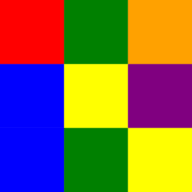
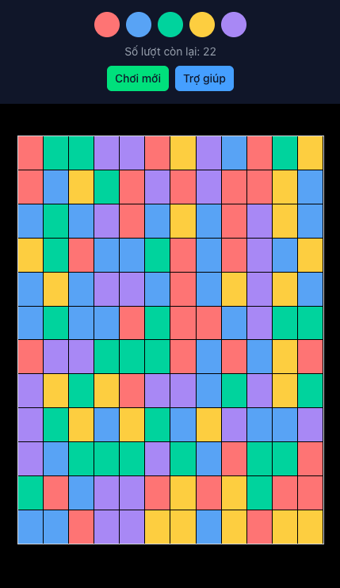

# Pixelated



An addictive game of strategy and color!

## About

Pixelated is a puzzle-based strategy game that requires a mix of skill and luck. The objective is to change the color of the squares until the entire screen is a single solid color.



## How To Play

Starting with the square in the upper left corner you can change the color of the blocks in order to match that of the surrounding squares. This is done repeatedly until the entire screen is one color. The goal is to clear the screen in as few moves as possible. You must do so in under 22 moves to win. The game is controlled by the color buttons at the bottom of the screen.

## Setup

Make sure to install dependencies:

```bash
# npm
npm install

# pnpm
pnpm install

# yarn
yarn install

# bun
bun install
```

## Development Server

Start the development server on `http://localhost:3000`:

```bash
# npm
npm run dev

# pnpm
pnpm dev

# yarn
yarn dev

# bun
bun run dev
```

## Production

Build the application for production:

```bash
# npm
npm run build

# pnpm
pnpm build

# yarn
yarn build

# bun
bun run build
```

Locally preview production build:

```bash
# npm
npm run preview

# pnpm
pnpm preview

# yarn
yarn preview

# bun
bun run preview
```
